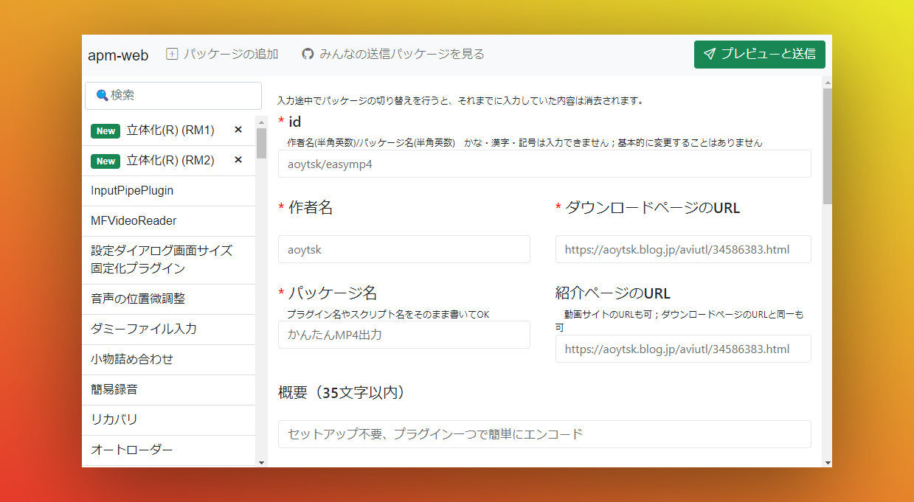

# apm-web

AviUtl Package Manager (apm) のパッケージデータを編集するためのWebベースのツール

このツールからプラグインやスクリプトの追加依頼を簡単に送信できます

### 🔗[team-apm.github.io/apm-web/](https://team-apm.github.io/apm-web/)

<br>



<br>

## コントリビューション

### デバッグ

```powershell
git clone https://github.com/team-apm/apm-web.git
cd apm-web
yarn
yarn dev
```

### デプロイ（GitHub Pages）

```powershell
yarn deploy
```

`main`ブランチの内容が自動でデプロイされるため上記コマンドの手動実行は必要ありません。

### フレームワーク

[Create Next App](https://nextjs-ja-translation-docs.vercel.app/docs/api-reference/create-next-app)を使用しています。

### 注意点

Google Formsを編集する際は`src/app/components/App.tsx`内の`formsUrl`、`formsAttribute`に含まれるGoogle Formsへのリンクを適宜変更してください。

パッケージデータの入力画面は`survey.js`により作成されています。[Survey Creator](https://surveyjs.io/create-survey)のJSON Editorに`src/app/data/survey.json`の内容をコピーアンドペーストしてから`Survey Designer`タブに移動することでGUIによる編集ができます。

オンライン版 Survey Creator (not survey-react) の利用はライセンス不要です。非営利目的の組み込み用ライセンスは無料で取得できますが申請が必要になります。

- [SurveyJs Creator License Model | surveyjs Support](https://web.archive.org/web/20220219115047/https://surveyjs.answerdesk.io/ticket/details/t8256/surveyjs-creator-license-model)
- [surveyjs How far is it free? | surveyjs Support](https://web.archive.org/web/20220219115407/https://surveyjs.answerdesk.io/ticket/details/t2733/surveyjs-how-far-is-it-free)

## ライセンス

コード: MITライセンス
